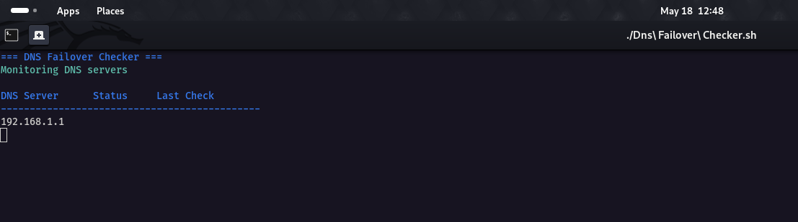
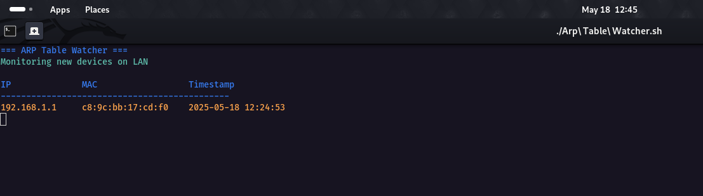

# ⚙️ Advanced Bash Scripts Toolkit

Welcome! This repository contains **30 professional Bash scripts** for system administration, automation, and ethical hacking. Every script is crafted for real-world use, with logs, colors, and clear output.

> `main.sh` is just a test/demo script — not counted in the main 30.

---

## 📁 Base Directory

All scripts are located in:

```bash
/home/negan/Desktop/BIN
```

---

## 🚀 Setup & Usage

### ✅ Make All Scripts Executable

```bash
chmod +x *.sh
```

### 🧰 Install Dependencies

#### For Debian/Ubuntu:

```bash
sudo apt update && sudo apt install figlet netcat-traditional nmap inotify-tools dnsutils network-manager cpulimit libimage-exiftool-perl rsync bc gzip curl mailutils
```

#### For CentOS/RHEL:

```bash
sudo yum install figlet nmap ncat inotify-tools bind-utils NetworkManager cpulimit perl-Image-ExifTool rsync bc gzip curl mailx
```

---

## 🧪 How to Run Scripts

```bash
./script_name.sh [arguments]
```

Some scripts require `sudo` if they touch network, system, or firewall configurations.

---

### 📸 Screenshots

---

### 🔍 WiFi Scanner  


---

### 🧠 Monitor Networks  


---

### 🧪 Checker  


---

### 👀 Watcher  


---


---

## 🛠️ Scripts Overview

Below are all 30 functional scripts with quick info:

| Script                               | Description                                        |
| ------------------------------------ | -------------------------------------------------- |
| `parallel_process_manager.sh`        | Run multiple commands in parallel with status view |
| `smart_resource_limiter.sh`          | Limit CPU & memory usage of any process            |
| `auto_daemonizer.sh`                 | Convert any command into a system-style daemon     |
| `log_rotator_plus.sh`                | Rotate & compress logs with status reporting       |
| `dynamic_cron_scheduler.sh`          | Add/remove/list cron jobs dynamically              |
| `multi_host_latency_monitor.sh`      | Monitor ping latency of multiple hosts             |
| `tcp_port_sniffer_raw.sh`            | Raw TCP packet sniffer (color logs)                |
| `arp_table_watcher.sh`               | Detect new LAN devices using ARP                   |
| `net_interface_auto_repair.sh`       | Auto-repair broken network interfaces              |
| `dns_failover_checker.sh`            | DNS server failover test & switcher                |
| `bash_ssh_guardian.sh`               | Block SSH brute-force via iptables                 |
| `file_integrity_checker.sh`          | Monitor file integrity using SHA256                |
| `suid_finder_audit.sh`               | Find risky SUID binaries in the system             |
| `password_strength_meter.sh`         | Check strength of a given password                 |
| `bash_based_firewall_manager.sh`     | Manage iptables rules via CLI                      |
| `recursive_dir_watcher.sh`           | Watch directory changes recursively                |
| `smart_backup_engine.sh`             | Full & incremental backups with hash checks        |
| `file_metadata_reporter.sh`          | Show file size, permissions, EXIF, ACLs            |
| `auto_archive_cleaner.sh`            | Archive or delete old files                        |
| `file_split_merge_utility.sh`        | Split/merge files with integrity check             |
| `ai_command_predictor.sh`            | Suggest commands based on history                  |
| `log_pattern_intel_extractor.sh`     | Extract useful data from logs                      |
| `system_health_ranker.sh`            | Score CPU, RAM, disk health                        |
| `intelligent_alert_notifier.sh`      | Alert via API or email for anomalies               |
| `bash_task_scheduler_ai.sh`          | Auto-reschedule tasks smartly                      |
| `bash_based_dns_exfiltrator.sh`      | Covert data exfiltration via DNS                   |
| `wifi_auto_scanner_logger.sh`        | Scan & log nearby WiFi networks                    |
| `bash_nmap_wrapper_ai.sh`            | Smart wrapper for powerful Nmap scans              |
| `bash_payload_generator.sh`          | Generate reverse/bind payloads with obfuscation    |
| `bash_reverse_shell_orchestrator.sh` | Manage multiple reverse shells                     |

---

## ⚠️ Troubleshooting

* **Permission Issues**: Try `chmod +x script.sh` or run with `sudo`
* **Missing Tools**: Use error messages to install missing packages
* **Log Files**: Most scripts log to `/tmp/` (e.g., `/tmp/script.log`)

---

## 🤝 Contributions

Found a bug? Want to improve something? Fork and submit a PR. Contributions are welcome!

---

## 📜 License

MIT License — Use, modify, and share freely, but ethically.

---

Stay safe, hack smart. 💻🛡️
